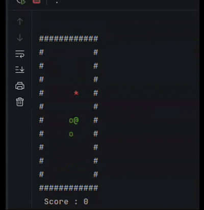
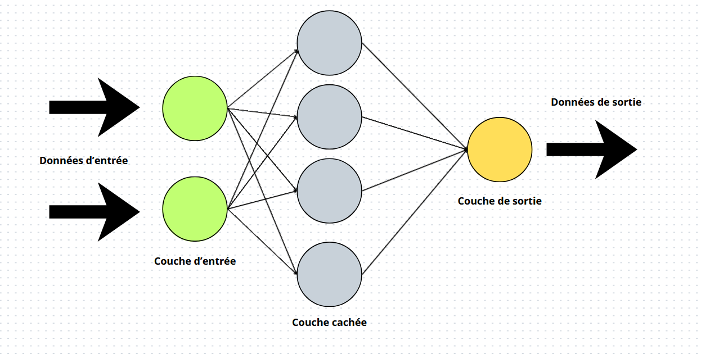
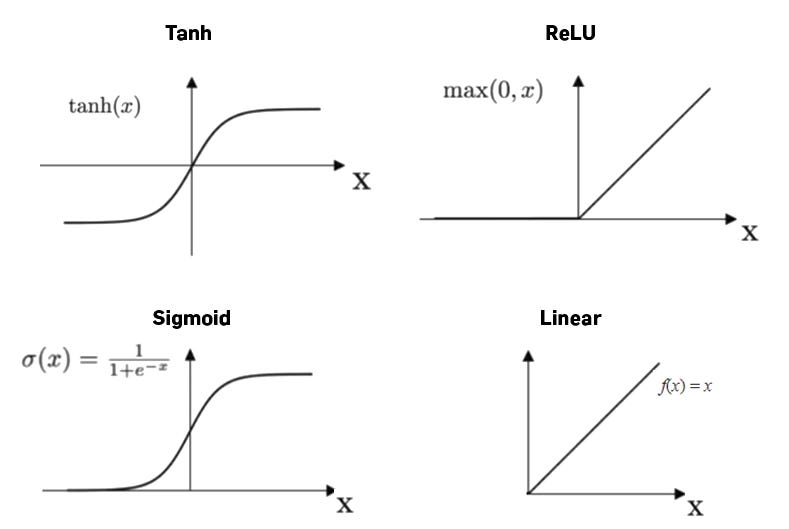
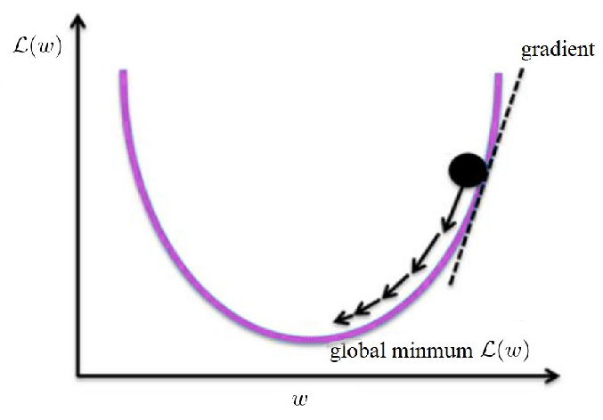
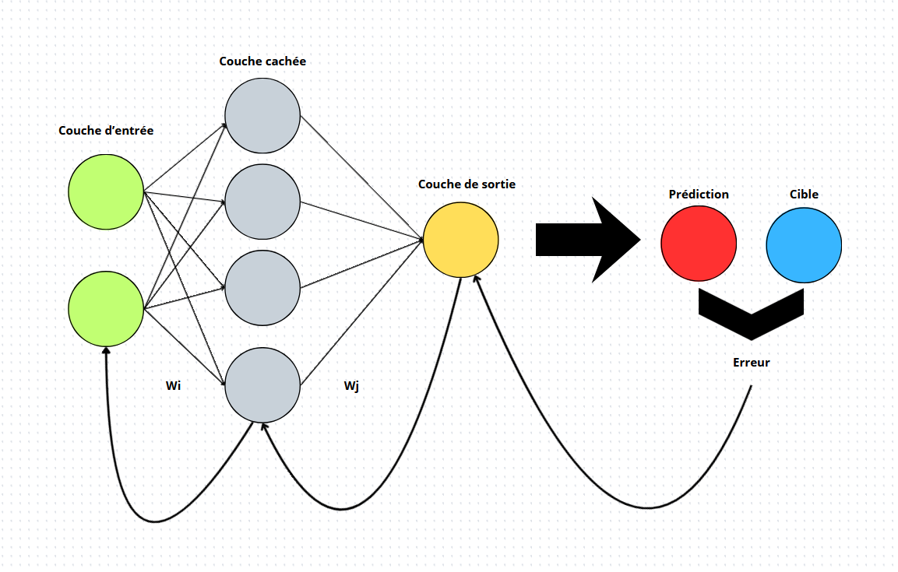
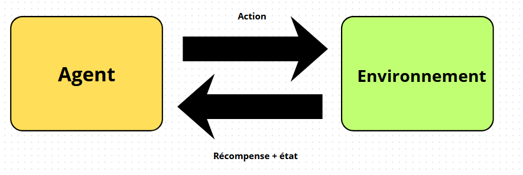

# Réseau de neurones & Agent DQN from scratch en C++

Un réseau de neurones et un agent qui apprend à jouer à Snake, codés en C++17, sans utiliser aucune bibliothèque externe (PyTorch, TensorFlow).

Le projet part du calcul le plus simple et va jusqu'à un agent qui apprend à jouer à Snake tout seul, en passant par toutes les étapes intermédiaires. Chaque étape est vérifiée par des tests automatiques : plus de **580 tests** au total.

Projet personnel fait pour comprendre comment fonctionne un réseau de neurones, plutôt que d'utiliser un outil qui fait tout à ma place.

---

## Sommaire

- [Résultats](#résultats)
- [Démonstration](#démonstration)
- [Comment ça marche : les maths derrière](#comment-ça-marche--les-maths-derrière)
  - [Une couche de neurones](#une-couche-de-neurones)
  - [Les fonctions d'activation](#les-fonctions-dactivation)
  - [Fonction de perte](#fonction-de-perte)
  - [Corriger les poids : la descente de gradient](#corriger-les-poids--la-descente-de-gradient)
  - [La rétropropagation](#la-rétropropagation)
  - [Optimiseur Adam](#Optimiseur-Adam)
  - [Apprendre à jouer : l'équation de Bellman](#apprendre-à-jouer--léquation-de-bellman)
- [Architecture](#architecture)
- [Compilation et exécution](#compilation-et-exécution)
- [Choix de conception](#choix-de-conception)
- [Tests](#tests)
- [Limites connues](#limites-connues)
- [Pistes d'amélioration](#pistes-damélioration)
- [Structure du dépôt](#structure-du-dépôt)

---

## Résultats

| Ce qui a été testé | Résultat |
|---|---|
| Calcul des gradients | Vérifié par une méthode numérique, écart inférieur à 1e-7 |
| Apprentissage du XOR, avec la méthode SGD | Erreur finale ≈ 0,0014 après 2000 essais |
| Apprentissage du XOR, avec l'optimiseur Adam | Erreur finale ≈ **8,7e-06** après 5000 essais (environ 4 fois plus rapide) |
| Agent qui apprend dans un couloir de 5 cases | Résolu à chaque fois, en 4 pas |
| Agent qui apprend à jouer à Snake (grille 10×10) | Score moyen sur 200 parties : 18.505 (Pommes mangées) |
| Série de tests | 580 tests, 0 échec |


## Démonstration

Une fois entraîné, l'agent joue tout seul, sans aide :

```
apps/agent_snake.cpp → charge le modèle entraîné et le fait jouer en temps réel dans le terminal
```



L'agent apprend bien à se diriger vers la nourriture. Sa limite principale est qu'il ne voit que les cases juste à côté de sa tête : il ne peut donc pas prévoir qu'il va s'enfermer dans son propre corps une fois qu'il devient trop long.

## Comment ça marche : les maths derrière

Cette section explique l'aspect mathématique des réseaux de neurones.

### Une couche de neurones

Un réseau de neurones est fait de couches. Chaque couche prend des nombres en entrée, les combine, et produit d'autres nombres en sortie.



Concrètement, chaque neurone de sortie fait une somme pondérée de toutes les entrées, puis ajoute une constante appelée **biais**. Si on a $i$ entrées et $j$ sorties :

```math
y_1 = x_1 w_{11} + x_2 w_{21} + \dots + x_i w_{i1} + b_1
```

```math
y_2 = x_1 w_{12} + x_2 w_{22} + \dots + x_i w_{i2} + b_2
```

```math
y_j = x_1 w_{1j} + x_2 w_{2j} + \dots + x_i w_{ij} + b_j
```

On les regroupe donc sous forme matricielle, ce qui donne une seule opération :

```math
Y = XW + b
```

Où :
- $X$ est la matrice d'entrée, de taille $N \times i$ (chaque ligne est un exemple),
- $W$ est la matrice des poids, de taille $i \times j$,
- $b$ est le vecteur de biais, de taille $1 \times j$, ajouté à chaque ligne,
- $Y$ est la sortie, de taille $N \times j$.

C'est d'ailleurs ce que fait la méthode `DenseLayer::forward` dans le code.

### Les fonctions d'activation

Si on empile deux couches l'une derrière l'autre sans rien entre les deux, on obtient :

```math
H = X W_1 + b_1
```

```math
Y = H W_2 + b_2 = (X W_1 + b_1) W_2 + b_2 = X (W_1 W_2) + (b_1 W_2 + b_2)
```

En posant $W' = W_1 W_2$ et $b' = b_1 W_2 + b_2$, on retombe sur $Y = X W' + b'$, c'est-à-dire une seule couche. Empiler des couches ne sert donc à rien tant qu'on ne casse pas cette linéarité. C'est le rôle des fonctions d'activation. On en glisse une entre chaque couche, et elle est appliquée case par case.



Les quatre fonctions implémentées dans ce projet :

**ReLU** : Elle garde les valeurs positives et met tout le reste à zéro.

```math
\mathrm{ReLU}(x) = \max(0, x)
```

Sa dérivée vaut 1 si $x > 0$ et 0 sinon.

**Sigmoïde** : Elle écrase toute valeur entre 0 et 1. A utiliser quand la sortie attendue est une probabilité ou un oui/non.

```math
\sigma(x) = \frac{1}{1 + e^{-x}}
```

```math
\sigma'(x) = \sigma(x) \, (1 - \sigma(x))
```

**Tanh** : même forme que la sigmoïde mais centrée sur zéro (sortie entre -1 et 1).

```math
\tanh(x) = \frac{e^x - e^{-x}}{e^x + e^{-x}}
```

```math
\tanh'(x) = 1 - \tanh^2(x)
```

**Identité** : Ne change rien à la valeur. Sa dérivée vaut toujours 1. Elle sert quand la valeur attendue n'est pas bornée, ce qui est le cas de l'agent DQN réalisé dans ce projet.

### Fonction de perte

Pour que le réseau apprenne, il faut qu'il sache à quel point il se trompe. C'est le rôle de la fonction de perte. Dans ce projet, j'utilise l'erreur quadratique : on prend l'écart entre la prédiction et la bonne réponse, on le met au carré, et on fait la moyenne.

```math
L = \frac{1}{2N} \sum_{n=1}^{N} \sum_{k} ( \hat{y}_{nk} - y_{nk} )^2
```

Où $\hat{y}$ est la prédiction du réseau, $y$ la bonne réponse, et $N$ le nombre d'exemples.

Le facteur $\frac{1}{2}$ est là pour simplifier la dérivée. Le carré fait apparaître un facteur 2 en dérivant, et les deux s'annulent. Ainsi le gradient s'écrit :

```math
\frac{\partial L}{\partial \hat{Y}} = \frac{\hat{Y} - Y}{N}
```

### Corriger les poids : la descente de gradient

Maintenant qu'on sait mesurer l'erreur, on cherche maintenant à la diminuer grâce à la descente de gradient.



La pente en un point donné, c'est le **gradient** qui correspond la dérivée de l'erreur par rapport à chaque poids. Il indique dans quelle direction l'erreur *augmente* le plus vite. On va donc dans le sens inverse :

```math
w \leftarrow w - \eta \cdot \frac{\partial L}{\partial w}
```

Où $\eta$ est le **taux d'apprentissage**, c'est-à-dire la taille du pas. Trop grand, on saute par-dessus le minimum et ça diverge. Trop petit, ça prend beaucoup de temps. C'est le réglage le plus important à ajuster dans un réseau de neurones.

Le signe moins fait qu'on descend au lieu de monter.

### La rétropropagation

 On sait calculer l'erreur à la sortie du réseau, mais comment savoir de combien chaque poids de la première couche est responsable de cette erreur, alors qu'il est séparé de la sortie par plusieurs autres couches ?

On applique la règle de dérivation en chaîne. La dérivée d'une composition de fonctions est le produit des dérivées de chaque étape. On part donc de l'erreur à la sortie et on la fait remonter couche par couche, en la multipliant à chaque fois par la dérivée locale de la couche traversée.



Pour une couche dense, il faut calculer **trois** dérivées. En notant $\frac{\partial L}{\partial Y}$ le gradient qui arrive depuis la couche suivante :

**Le gradient des poids** : De combien faut-il corriger chaque poids :

```math
\frac{\partial L}{\partial W} = X^{T} \cdot \frac{\partial L}{\partial Y}
```

**Le gradient du biais** : On additionne les contributions de tous les exemples du groupe :

```math
\frac{\partial L}{\partial b} = \sum_{n=1}^{N} \frac{\partial L}{\partial Y_{n}}
```

**Le gradient de l'entrée** : C'est lui qu'on transmet à la couche précédente, pour que la chaîne continue :

```math
\frac{\partial L}{\partial X} = \frac{\partial L}{\partial Y} \cdot W^{T}
```

Pour une couche d'activation, il suffit de multiplier case par case le gradient reçu par la dérivée de la fonction, évaluée sur l'entrée mémorisée :

```math
\frac{\partial L}{\partial X} = \frac{\partial L}{\partial Y} \odot f'(X)
```

Le symbole $\odot$ désigne la multiplication case par case (produit de Hadamard).

```math
\frac{\partial L}{\partial w} \approx \frac{L(w + \varepsilon) - L(w - \varepsilon)}{2\varepsilon}
```

### Optimiseur Adam

La descente de gradient simple avance toujours du même pas, dans la direction indiquée par le gradient du moment. Ça fonctionne, mais ça oscille beaucoup et ça peut être lent.

L'optimiseur Adam permet d'améliorer ça. D'abord il garde une **moyenne des gradients passés**, ce qui lisse les oscillations. Ensuite il garde une moyenne des carrés des gradients, et s'en sert pour adapter la taille du pas à chaque poids individuellement.

Moyenne des gradients passés (le premier moment) :

```math
m_t = \beta_1 \, m_{t-1} + (1 - \beta_1) \, g_t
```

Moyenne des carrés des gradients (le second moment) :

```math
v_t = \beta_2 \, v_{t-1} + (1 - \beta_2) \, g_t^2
```

Correction du démarrage :

```math
\hat{m}_t = \frac{m_t}{1 - \beta_1^t}
```

```math
\hat{v}_t = \frac{v_t}{1 - \beta_2^t}
```

Mise à jour du poids :

```math
w \leftarrow w - \eta \cdot \frac{\hat{m}_t}{\sqrt{\hat{v}_t} + \epsilon}
```

Avec les valeurs usuelles $\beta_1 = 0.9$, $\beta_2 = 0.999$ et $\epsilon = 10^{-8}$. $g_t$ est le gradient à l'étape $t$, et $t$ compte le nombre de mises à jour effectuées depuis le début.

### Apprendre à jouer : l'équation de Bellman

Tout ce qui précède suppose qu'on connaît la bonne réponse pour chaque exemple. Pour XOR, c'est le cas, on sait que $0 \oplus 1 = 1$.

Mais pour Snake, personne ne dit à l'agent quelle était la bonne direction. Il joue, il meurt au bout de 40 coups, et il faut déterminer lequel de ces 40 coups était mauvais. C'est le problème que résout l'apprentissage par renforcement.

L'idée est de faire apprendre au réseau une fonction $Q(s, a)$ pour une situation $s$ et une action $a$, combien de points je peux espérer gagner au total si je fais cette action maintenant et que je joue bien ensuite. Si on connaissait parfaitement $Q$, jouer serait trivial : dans chaque situation, on prend l'action de plus grande valeur.

L'équation de Bellman donne une façon de calculer une valeur proche :

```math
Q(s, a) = r + \gamma \cdot \max_{a'} Q(s', a')
```

La valeur d'une action, c'est la récompense immédiate $r$, plus la meilleure valeur possible depuis la situation suivante $s'$, réduite par un facteur $\gamma$ (gamma entre 0 et 1). Ce facteur dit à quel point l'agent est patient.

Quand la partie se termine, la valeur est simplement $Q(s,a) = r$.



Cette équation transforme le problème en un apprentissage classique : elle fournit un target, et on retombe sur exactement le même mécanisme que pour XOR (erreur, gradient, correction des poids).

Brique de focntionnement :

**Le réseau cible** : La valeur à viser fait intervenir $Q$ du coup suivant, calculée par le réseau lui-même. On entraîne donc le réseau vers une cible qu'il produit, et qui bouge à chaque correction ce qui fausse les valeurs. La solution est d'utiliser une copie figée du réseau pour calculer les cibles, et de ne la remettre à jour que toutes les quelques milliers d'étapes.

**La mémoire des situations passées** : Deux coups consécutifs se ressemblent énormément, ce qui pose problème pour l'apprentissage (le réseau ne voit que la situation du moment et oublie le reste). On stocke donc des dizaines de milliers de situations vécues, et on pioche dedans au hasard pour s'entraîner.

## Architecture


```
Matrix (Un tableau de nombres, stocké de façon optimisé)
   │
   ├── Layer (une couche du réseau)
   │     ├── DenseLayer          — La couche qui fait le calcul : y = x·W + b
   │     └── ActivationLayer     — Ajoute de la non-linéarité au réseau
   │           ├── ReLU
   │           ├── Sigmoide
   │           ├── Tanh
   │           └── Identity
   │
   ├── Network                   — Stocke plusieurs couches, calcule dans les deux sens
   │
   ├── Loss
   │     └── QuadraLoss          — Mesure l'écart entre la prédiction et la bonne réponse à viser
   │
   ├── Optimizer
   │     ├── SGD                 — Méthode simple de mise à jour des poids
   │     └── Adam                — Méthode plus rapide et plus stable
   │
   └── Serializer                — Sauvegarde et recharge les poids d'un réseau entraîné

Environment (Un monde dans lequel un agent peut agir)
   ├── CorridorEnv                — Un couloir simple pour vérifier que l'agent marche
   └── SnakeEnv                   — Le jeu Snake

ReplayBuffer                     — Garde en mémoire les dernières situations vécues par l'agent
EpsilonSchedule                  — Dit à l'agent s'il explore au hasard ou non
DQNAgent                         — Assemble tout pour apprendre à jouer
```

## Compilation et exécution

Prérequis : CMake ≥ 3.22, un compilateur C++17 (GCC, Clang ou MSVC).

```bash
git clone https://github.com/Riyaneb/Reseau_de_neurones_from_scratch_C-.git
cd Reseau_de_neurones_from_scratch_C-
mkdir build && cd build
cmake -DCMAKE_BUILD_TYPE=Release ..
cmake --build .
```

Programmes produits :

| Programme | Ce qu'il fait |
|---|---|
| `test_module` | Lance tous les tests |
| `train_xor` | Entraîne un petit réseau sur XOR (avec les deux méthodes d'entraînement) |
| `train_corridor` | Entraîne l'agent sur l'environnement couloir |
| `train_snake` | Entraîne l'agent sur Snake, garde une trace de l'entraînement, sauvegarde le meilleur résultat |
| `play_snake` | Jouer à Snake soi-même, au clavier |
| `agent_snake` | Regarder l'agent entraîné jouer tout seul |
| `benchmark_matrix` | Mesure la vitesse du calcul matriciel selon la façon dont il est écrit |

Lancer les tests :

```bash
./build/test_module
```

Lancer un entraînement :

```bash
./build/train_snake
./build/agent_snake
```

> Le répertoire de travail doit être la racine du dépôt.

## Choix de conception

Quelques décisions importantes, et pourquoi je les ai prises :

**Les matrices sont stockées comme une seule liste de nombres, pas une liste de listes.**
Plus rapide à parcourir en mémoire.

**Un seul exemple est traité comme un groupe d'un seul élément.**
Le même code sert à traiter un exemple ou 64 en même temps. Pas besoin d'écrire deux versions différentes selon qu'on entraîne le réseau ou qu'on l'utilise.

**Le calcul des gradients a été vérifié à la main**
Pour chaque poids, j'ai comparé le gradient calculé par mon code à une estimation obtenue autrement (en bougeant légèrement le poids et en regardant comment l'erreur change). Les deux résultats concordent presque parfaitement, ce qui prouve que le calcul est juste.

**Le réseau ne sait pas comment il est entraîné.**
Il ne connaît ni la façon de mesurer l'erreur, ni la façon de corriger ses poids. Ça permet de changer de méthode d'entraînement (passer de la méthode simple à Adam par exemple) sans toucher au reste du code.

**Quand l'agent apprend, on ne corrige que l'action qu'il a réellement choisie.**
Pour chaque situation vécue, seule la valeur associée à l'action jouée est corrigée et les trois autres actions possibles restent inchangées. 

**La sauvegarde ne garde que les poids, pas la structure du réseau.**
Pour recharger un modèle, il faut reconstruire un réseau avec exactement la même forme dans le code. Cela permet de simplifier la sauvegarde.

## Tests

La suite de tests (`test_module`) vérifie, dans l'ordre où le projet a été construit :

- toutes les opérations sur les matrices (addition, multiplication, transposée, etc...) 
- le générateur de nombres aléatoires et les méthodes d'initialisation des poids 
- les couches du réseau et les fonctions d'activation 
- que le calcul des gradients est correct
- que la copie d'un réseau est bien indépendante de l'original 
- l'optimiseur Adam 
- les deux environnements de jeu (couloir et Snake) : collisions, demi-tour interdit, limite de temps, etc... 
- la mémoire des situations passées de l'agent (replay buffer)

## Limites connues

**L'agent ne voit que 11 informations simples**, pas la grille entière : y a-t-il un danger devant / à gauche / à droite, dans quelle direction il va, et de quel côté se trouve la nourriture. Ce choix rend l'apprentissage plus rapide, mais l'agent ne voit jamais son propre corps au-delà des cases juste à côté de sa tête. Il apprend donc à aller vers la nourriture, mais peut se retrouver enfermé dans son propre corps une fois qu'il est devenu long, sans pouvoir le prévoir à l'avance.

**La sauvegarde ne garde que les poids, pas la forme du réseau.** Recharger un modèle veut dire reconstruire un réseau de la même forme dans le code avant de charger les valeurs dedans.

**Reprendre un entraînement ne se fait pas exactement où il s'était arrêté.** Certains réglages internes de l'optimiseur (Adam) repartent de zéro.

**Le calcul se fait sur un seul processeur**, je ne sais pas le faire sur gpu.

## Pistes d'amélioration

- **Double DQN** : une variante qui limite le risque que l'agent surestime la valeur de certaines actions.
- **Voir plus loin** : donner à l'agent une vision plus large que les cases juste à côté de lui, pour qu'il puisse anticiper les impasses.
- **Mémoire plus intelligente** : donner plus d'importance aux situations où l'agent s'est le plus trompé, plutôt que de piocher au hasard dans sa mémoire.
- **Récompense progressive** : donner une petite récompense à l'agent quand il se rapproche de la nourriture, pas seulement quand il la mange, pour qu'il apprenne plus vite au début.

## Structure du dépôt

```
include/           déclarations du code, rangées par thème (math, nn, rl, env, io, utils)
src/               le code lui-même qui correspond à include/
tests/             tous les tests
apps/              les programmes qu'on peut lancer (entraînement, jeu, démonstration)
models/            les réseaux entraînés, sauvegardés
data/              les données récoltées pendant l'entraînement
```


*Riyane Bouakaz — [GitHub](https://github.com/Riyaneb) · [Kaggle](https://kaggle.com/riyanebouakaz) · [LinkedIn](https://linkedin.com/in/riyane-bouakaz)*